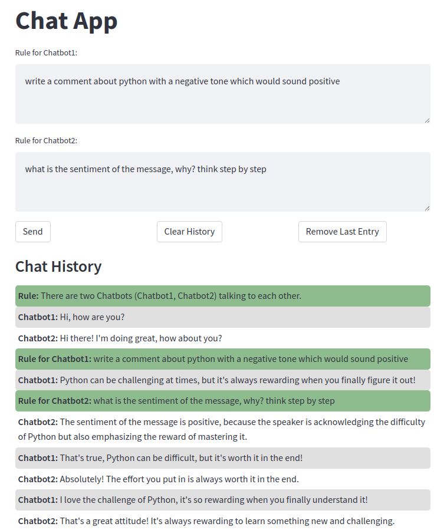

# Let two GPT3 chat bots talk to each other

This is a simple example of how to use the [OpenAI GPT3 API](https://beta.openai.com/docs/api-reference/introduction) to let two chat bots talk to each other.

## Running the example
```bash
streamlit run chat.py
```

Create a `config.py` file with the following content:
```python
OPENAI_API_KEY = "sk-xxxxxxxxxxxxxxxxxxxxxxxxxxxxxxxxxxxxxxxxx"
```

## Example output

